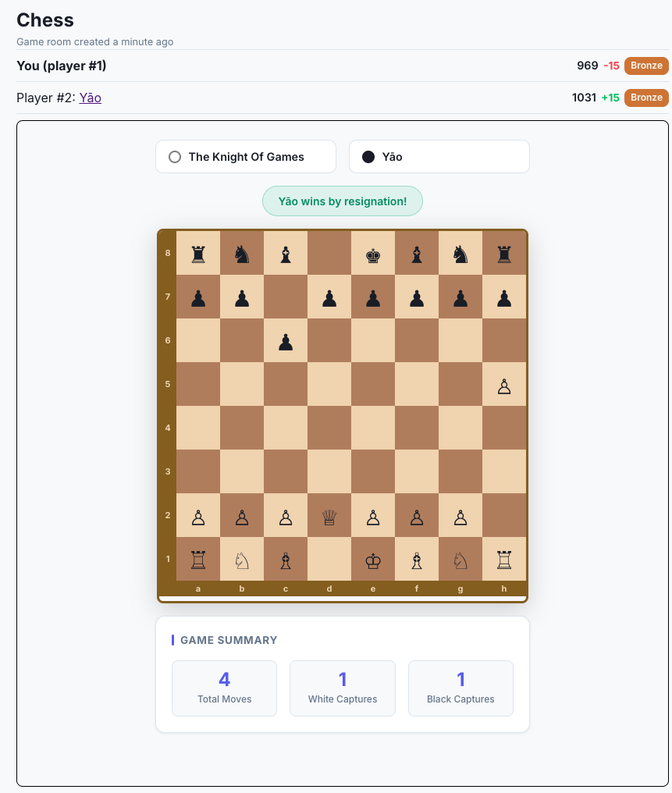
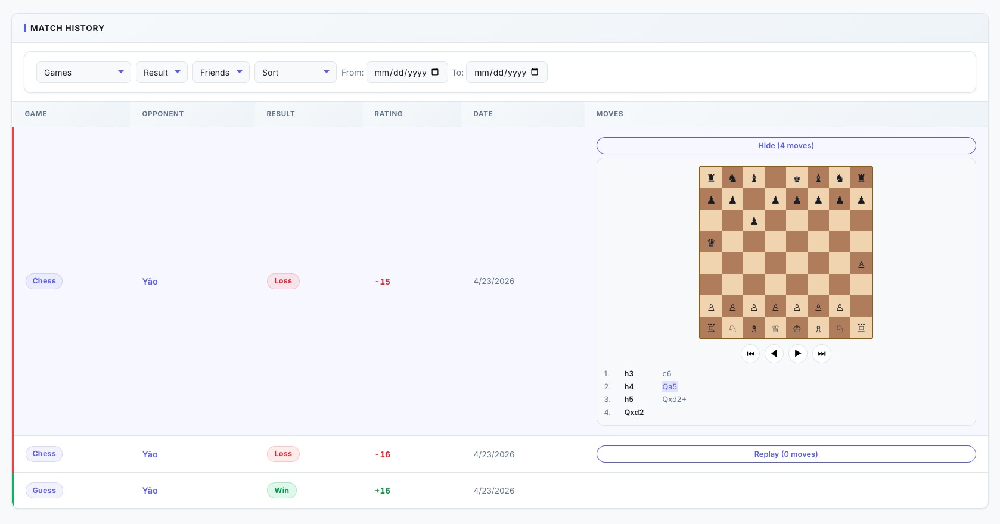
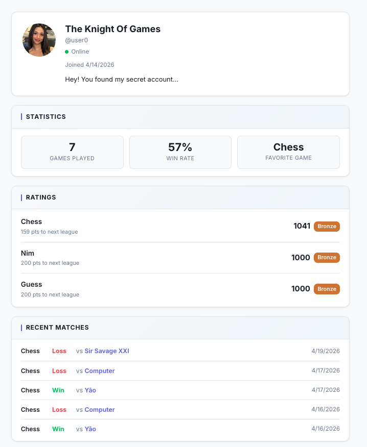
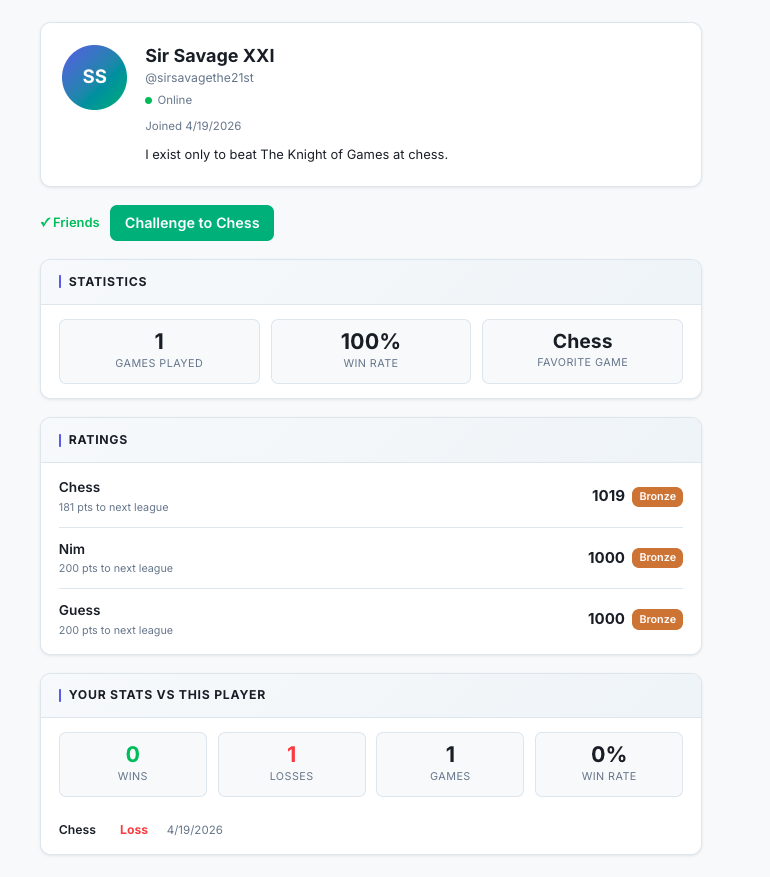

<div align="center">

# GameNite

### A full-stack multiplayer gaming platform with real-time gameplay, Elo-based rankings, and social features. Built with TypeScript, React, Node.js, and MongoDB.

<br/>

[](https://github.com/kashvime/gamenite/actions)
&nbsp;


<br/>
<a href="https://gameniteserver-production.up.railway.app">
  "/>
</a>

</div>

<br/>

---

## Features

### Chess

Full rule enforcement via chess.js — castling, en passant, pawn promotion,
check, stalemate, and checkmate. Optional 5 10 30 minute time controls,
resignation, and an AI opponent at three difficulty levels. Elo ratings update
live the moment a game ends.

<br/>
<div align="center">
  
</div>
<br/>

Every match is logged with opponent, result, exact rating delta, and date.
From match history you can filter by game type, result, opponent, or date
range — and expand any chess game to step through moves on an inline replay
board with the full move list.

<br/>
<div align="center">
  
</div>
<br/>

**The game architecture is extensible by design.** Each game implements a
`GameLogic<State, View>` interface — start update isDone winner viewAs — and
registers itself in a central service map. Adding a new game means dropping in
one new file per layer (types, server logic, React component) with no changes
to core infrastructure.

---

### Platform

**Elo + Leagues** — every completed match updates both players' ratings using
the standard Elo formula K=32. Cross a threshold and you're automatically
promoted or demoted between Bronze Silver Gold. A live socket event fires so
every connected client updates instantly.

**Leaderboard** — global or friends-only, filterable by game type and league.
Your own rank is always visible even if you fall outside the top 30.

**Friends and Profiles** — every user has a public profile showing per-game
ratings, progress to next league, win rate, and recent matches. On a friend's
profile, you also see your head-to-head record against them.

<br/>
<table>
<tr>
<td width="50%"></td>
<td width="50%"></td>
</tr>
<tr>
<td align="center"><sub>Per-game ratings · league progress · win rate</sub></td>
<td align="center"><sub>Head-to-head stats on any friend's profile</sub></td>
</tr>
</table>
<br/>

**Private Games** — generate an invite code, share it, and spectators can
watch live via the same WebSocket room.

**Auth** — username/password or Google SSO via OAuth 2.0. Both flow through a
Passport.js strategy abstraction that issues the same JWT. The rest of the app
never knows which provider was used.

---

## System Architecture

<br/>
<div align="center">
  
</div>
<br/>

> React communicates over REST for CRUD and WebSocket via Socket.io for live
> game state. Board state is authoritative server-side only — the client never
> mutates, only renders what it receives.

---

## How It's Built

**Storage** — a Keyv abstraction wraps every repository. In production a
single env var points it at MongoDB. No conditionals scattered through the
app, no code change required.

**Elo writes are atomic** — when a game ends, the rating delta for both
players is calculated and committed in a single service call. A crash
mid-update can't leave one player's rating changed and the other's untouched.

**End-to-end type safety** — `shared/src/socket.types.ts` is a single package
imported by both client and server. If an event name or payload shape changes
on one side, the build fails before anything ships.

```ts
interface ServerToClientEvents {
  gameStateUpdated: (
    payload: TaggedGameView & { forPlayer: boolean },
  ) => void;
  gameRatingUpdated: (payload: { changes: RatingDelta[] }) => void;
  leagueChanged: (payload: { newLeague: League; oldLeague: League }) => void;
  friendRequestReceived: (payload: { from: SafeUserInfo }) => void;
}
```

**Chess AI is async** — after a human move, the AI response is scheduled with
a short delay and runs outside the request cycle. The event loop never blocks
waiting for minimax to finish. Hard mode uses alpha-beta pruning and
piece-square tables at depth 3.

---

## API Routes

<details>
<summary>User</summary>
<br/>

| Method | Route                 | Description                     |
| :----: | --------------------- | ------------------------------- |
| `POST` | `/api/user/signup`    | Create account → JWT            |
| `POST` | `/api/user/login`     | Authenticate → JWT              |
| `GET`  | `/api/user/:username` | Public profile                  |
| `POST` | `/api/user/:username` | Update display name or password |
| `POST` | `/api/user/list`      | Bulk user lookup                |

</details>

<details>
<summary>Game</summary>
<br/>

| Method | Route                    | Description                      |
| :----: | ------------------------ | -------------------------------- |
| `POST` | `/api/game/create`       | Create game (public or private)  |
| `GET`  | `/api/game/list`         | Active games                     |
| `GET`  | `/api/game/:id`          | Game state                       |
| `POST` | `/api/game/join-by-code` | Join private game by invite code |

</details>

<details>
<summary>Friends</summary>
<br/>

| Method | Route                 | Description                   |
| :----: | --------------------- | ----------------------------- |
| `POST` | `/api/friend/request` | Send friend request           |
| `POST` | `/api/friend/respond` | Accept / decline              |
| `POST` | `/api/friend/list`    | Your friends                  |
| `POST` | `/api/friend/pending` | Pending requests              |
| `POST` | `/api/friend/status`  | Friendship status with a user |

</details>

<details>
<summary>Scores &amp; Matches</summary>
<br/>

| Method | Route                     | Description                |
| :----: | ------------------------- | -------------------------- |
| `GET`  | `/api/scores/leaderboard` | Global rankings            |
| `POST` | `/api/scores/myrank`      | Your current rank          |
| `POST` | `/api/matches`            | Match history with filters |

</details>

<details>
<summary>Forum</summary>
<br/>

| Method | Route                     | Description    |
| :----: | ------------------------- | -------------- |
| `POST` | `/api/thread/create`      | New forum post |
| `GET`  | `/api/thread/list`        | All posts      |
| `GET`  | `/api/thread/:id`         | Single post    |
| `POST` | `/api/thread/:id/comment` | Add comment    |

</details>

<details>
<summary>Auth</summary>
<br/>

| Method | Route                   | Description                 |
| :----: | ----------------------- | --------------------------- |
| `GET`  | `/auth/google`          | Initiate Google OAuth       |
| `GET`  | `/auth/google/callback` | Google OAuth callback → JWT |

</details>

---

## Testing

Three-layer coverage across every critical path.

| Layer       | Tool               | Covers                                     |
| ----------- | ------------------ | ------------------------------------------ |
| Unit        | Vitest             | Chess rules, Elo algorithm, auth, services |
| Integration | Vitest + supertest | All REST endpoints, Socket.io events       |
| E2E         | Playwright         | Login, game creation, chat, full gameplay  |

```bash
npm test          # run all layers
npm run check     # TypeScript, all packages
npm run lint      # ESLint, all packages
```

---

## Quick Start

```bash
git clone https://github.com/kashvime/gamenite
cd gamenite && npm install
cp server/.env.example server/.env
npm run dev    # Vite :4530  ·  Express :8000
```

Test accounts: `user0/pwd0000` · `user1/pwd1111` · `user2/pwd2222` ·
`user3/pwd3333`

---

## Contributors

<table>
<tr>
<td align="center" width="25%">
  <b>Kashvi</b><br/>
  <a href="https://github.com/kashvime">@kashvime</a><br/>
  <sub>Database layer · Elo + league system · match history · game flow</sub>
</td>
<td align="center" width="25%">
  <b>Tanisha</b><br/>
  <a href="https://github.com/tanishajoshii">@tanishajoshii</a><br/>
  <sub>Chess features · UI · profile page</sub>
</td>
<td align="center" width="25%">
  <b>Ha</b><br/>
  <a href="https://github.com/hanguyen04">@hanguyen04</a><br/>
  <sub>Friends · leaderboard · private games</sub>
</td>
<td align="center" width="25%">
  <b>Aunnie</b><br/>
  <a href="https://github.com/Aunnieo">@Aunnieo</a><br/>
  <sub>Google SSO · Chess AI · test coverage</sub>
</td>
</tr>
</table>
